# Boss Clinician

A custom-built course, community and commerce platform for **Yvette Howard, LCSW** — coaching
therapists who are building independent private practices (the *B.O.S.S Blueprint*).

It replaces a Kajabi site. That single sentence explains most of the design: this is not a blog
with a Stripe button, it is a like-for-like replacement for an all-in-one platform, so it carries
offers, order bumps, upsells, payment plans, memberships, drip courses, a community, email
sequences, broadcasts, automations, affiliates, certificates and reporting — all editable from
`/admin` by a non-technical owner.

**Live:** https://bossclinician.callsphere.site (staging host; the target is `bossclinician.com`)

---

## Table of contents

1. [Read this first](#1-read-this-first)
2. [The stack](#2-the-stack)
3. [How a request is routed](#3-how-a-request-is-routed)
4. [Repo layout](#4-repo-layout)
5. [Running it locally](#5-running-it-locally)
6. [The domain model](#6-the-domain-model)
7. [Database schema](#7-database-schema)
8. [Core flows](#8-core-flows)
9. [Background jobs](#9-background-jobs)
10. [Email](#10-email)
11. [Authentication and authorisation](#11-authentication-and-authorisation)
12. [Environment variables](#12-environment-variables)
13. [Testing](#13-testing)
14. [Deploying](#14-deploying)
15. [Conventions](#15-conventions)
16. [Traps that have already bitten someone](#16-traps-that-have-already-bitten-someone)
17. [Where to look for what](#17-where-to-look-for-what)

---

## 1. Read this first

Four facts that change how you work in this repo:

| Fact | Consequence |
|---|---|
| **Stripe is in LIVE mode** on the deployed stack | Never "just test a checkout". A real card is a real charge to a real business. Use test keys locally. |
| **`/admin` is used by the business owner, not by engineers** | No jargon in admin UI copy. No "webhook", "JSON", "slug" in a label she has to read. |
| **The server is 8 GB / 2 cores and also runs another product's k3s cluster** | Build serially (`COMPOSE_PARALLEL_LIMIT=1`). A parallel Vite build invites the OOM killer, and it usually kills Postgres, not the build. |
| **Green tests have never caught the real defects here** | The bugs that reached production were wiring bugs — a route not mounted, a map not regenerated, a webhook not verified. Verify against the running system, not the test run. See `docs/bugs/`. |

Long-form background lives in:

- [`ARCHITECTURE.md`](ARCHITECTURE.md) — the original build brief and API contract
- [`DEPLOY.md`](DEPLOY.md) — server topology, build rules, deploy runbook. **Read before deploying.**
- [`docs/AUDIT.md`](docs/AUDIT.md) — a full adversarial audit of the system
- [`docs/EMAIL.md`](docs/EMAIL.md) — SES setup, deliverability, the send pipeline
- [`docs/bugs/`](docs/bugs/) — per-area defect notes, the most useful reading in the repo

---

## 2. The stack

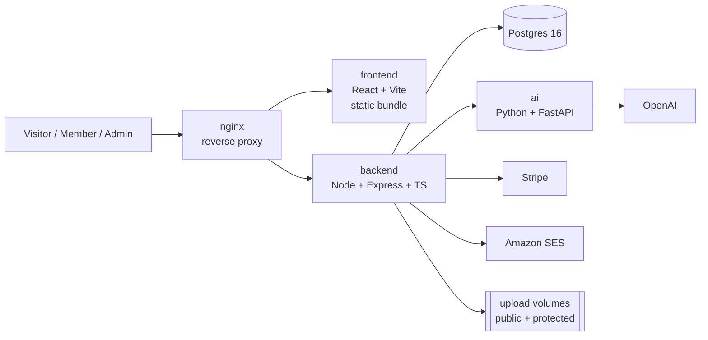

| Service | Stack | Port | Role |
|---|---|---|---|
| `nginx` | nginx 1.27 | 8088 on the host bridge | TLS terminates upstream in k3s Traefik; routes by path |
| `frontend` | React 18, Vite, TypeScript, Tailwind, Motion, Radix | 80 in-network | Public marketing site + `/admin` CMS + member area |
| `backend` | Node 20, Express 4, TypeScript, `pg`, Stripe, nodemailer, pdfkit, zod | 4000 | REST API, auth, jobs, SSR of marketing pages |
| `ai` | Python, FastAPI, OpenAI | 8000 | Coaching chatbot, blog generation, lead qualification |
| `db` | Postgres 16 | 5432 in-network | Everything. Not published to the host. |

The browser never talks to the AI service. The backend proxies it, so the OpenAI key stays
server-side.

---

## 3. How a request is routed

There are three different things nginx can do with a URL, and knowing which is which saves an
afternoon.

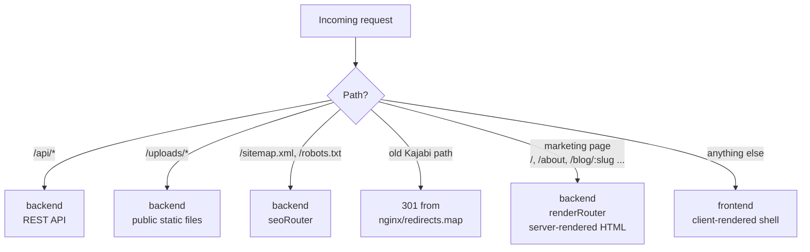

**Why marketing pages are server-rendered.** The old site is indexed. A client-rendered shell
returns an empty document to a crawler, so every ranked URL would have arrived at a blank page on
cutover. `backend/src/routes/public/render.ts` holds the explicit list of paths that get real HTML,
and it is mounted *last* in `app.ts` so it can never shadow an API route.

**Why nginx and the backend both know that list.** nginx has to send those paths to the backend
instead of the frontend container. The two lists must be changed together — `nginx/site.conf` and
`render.ts`.

Inside the backend, the mount order in `backend/src/app.ts` is itself load-bearing:

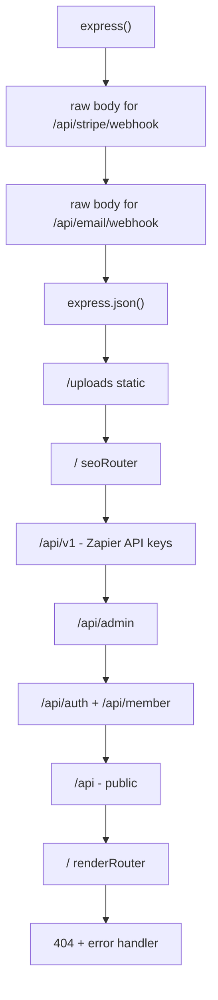

The two raw-body mounts must stay ahead of `express.json()`. Stripe and SES sign the exact bytes
they sent; once JSON has parsed the stream those bytes are gone and no signature can ever verify.

---

## 4. Repo layout

```
bossclinician/
├── backend/
│   ├── src/
│   │   ├── app.ts              # route mounting; read this first
│   │   ├── server.ts           # boot: migrate → seed → register jobs → listen
│   │   ├── auth/               # password hashing, JWT signing, key separation
│   │   ├── automations/        # engine.ts (v1, legacy) + engineV2.ts (When/If/Then)
│   │   ├── config/env.ts       # every env var, validated, in one place
│   │   ├── db/
│   │   │   ├── schema.sql      # the original 48 tables
│   │   │   ├── migrations/     # 001–020, applied in order at boot
│   │   │   ├── pool.ts         # the single pg Pool
│   │   │   └── repos.ts        # query helpers
│   │   ├── email/              # provider.ts is the one door all mail goes through
│   │   ├── jobs/               # queue, worker, and per-feature handlers
│   │   ├── middleware/         # auth, rate limits, role gates, error handler
│   │   ├── routes/
│   │   │   ├── public/         # no auth
│   │   │   ├── auth/           # member register / login / refresh / reset
│   │   │   ├── member/         # signed-in member area
│   │   │   └── admin/          # JWT + role gated CMS
│   │   ├── services/           # the business logic; routes stay thin
│   │   ├── ssr/                # server-side render of the React app
│   │   └── seed/               # first-boot content from shared/content.json
│   └── scripts/                # nginx redirect map generator, integration test runner
├── frontend/
│   └── src/
│       ├── App.tsx             # every route in the app
│       ├── pages/              # public pages + member/ + admin/ + legal/
│       ├── components/         # ui/ (design system), home/, luxe/, member/, checkout/ ...
│       ├── entry-client.tsx    # browser hydrate
│       ├── entry-server.tsx    # SSR entry, imported by the backend
│       ├── seo/                # <head> + JSON-LD builders
│       └── ssr/                # data preload + hydration context
├── ai/                         # FastAPI service: /chat, /generate/blog, /qualify-lead
├── shared/                     # content.json seed, brand.md
├── nginx/                      # site.conf + generated redirects.map
├── k8s/                        # Traefik ingress into the compose stack
├── docs/                       # AUDIT.md, EMAIL.md, bugs/
└── docker-compose.yml
```

---

## 5. Running it locally

### Prerequisites

Node 20+, Python 3.11+, Docker (or a local Postgres 16), and Stripe **test** keys.

### The fast path — everything in Docker

```bash
cp backend/.env.example backend/.env      # then fill in the values
cp frontend/.env.example frontend/.env
cp ai/.env.example ai/.env                # OPENAI_API_KEY

COMPOSE_PARALLEL_LIMIT=1 docker compose build
docker compose up -d --wait
```

`--wait` matters: migrations and the first-boot seed run *inside* the API process before it
listens, so the backend's healthcheck going green is the signal that the database is ready.

### The developer path — services on the host

```bash
# 1. Postgres
docker compose up -d db

# 2. Backend (migrates + seeds on boot)
cd backend && npm install && npm run dev        # :4000

# 3. Frontend
cd frontend && npm install && npm run dev       # :5173

# 4. AI service (optional; the chat widget degrades without it)
cd ai && pip install -r requirements.txt && uvicorn app.main:app --reload   # :8000
```

Admin login is seeded from `ADMIN_EMAIL` / `ADMIN_PASSWORD` on first boot. Sign in at
`/admin/login`.

With no `SMTP_*` set, mail is written to the console instead of sent — that is the intended dev
behaviour, not a failure.

---

## 6. The domain model

Six ideas carry the whole system. Learn these and the 131 tables stop being frightening.

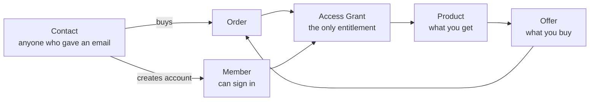

- **Contact** — anyone who has ever given an email address. Downloading a PDF makes a contact.
  Contacts carry tags, segments, sequence subscriptions, lifetime value.
- **Member** — a contact who has an account and can sign in. *Not* every contact is a member.
  (The v1 automation engine got this wrong and created a member for anyone it touched; v2 fixed it.)
- **Product** — the thing delivered: a course, a download, community access, a coaching package,
  a podcast, a newsletter, an access group, or a bundle of the above.
- **Offer** — the thing sold: price, pricing type (`one_time`, `subscription`, `payment_plan`,
  `free`, `pwyw`), checkout fields, bumps, upsells. One offer can contain several products.
- **Order** — one purchase attempt. Becomes `paid` in exactly one place: `services/fulfillment.ts`.
- **Access grant** — the single source of truth for "may this member open this product". Every
  delivery route consults `services/access.ts` and nothing else. It deliberately does not look at
  orders or subscriptions, because entitlement has too many sources (purchase, bundle, automation,
  manual grant, affiliate, import) for each reader to re-derive correctly.

---

## 7. Database schema

Postgres 16. `backend/src/db/schema.sql` creates the original 48 tables; `migrations/001`–`020`
add the rest and are applied in order at boot by `db/migrate.ts`. There is no separate migration
step and only one backend replica, so there is no concurrent-migration hazard.

131 tables in five clusters. The diagrams below show the load-bearing ones, not all of them.

### 7.1 Commerce

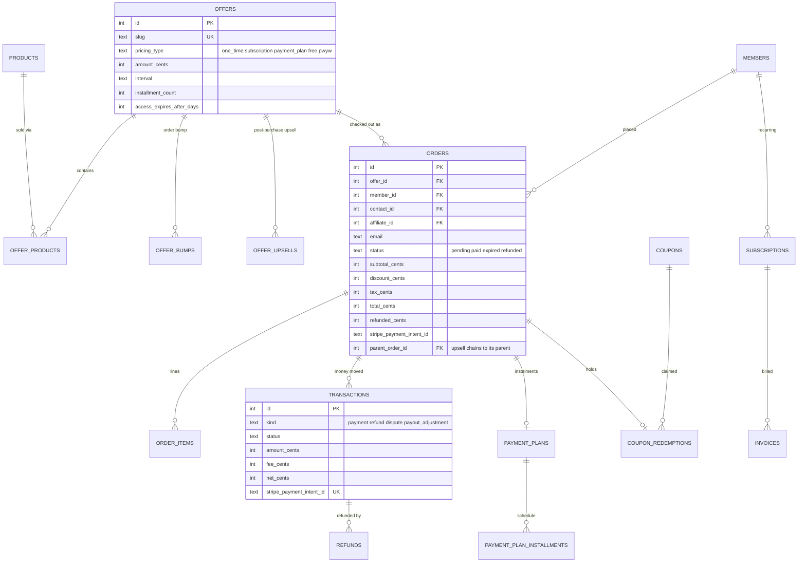

`transactions` is the ledger every report reads. Refunds are written here too — a report that
reads `orders.total_cents` alone will overstate revenue.

### 7.2 Access and learning

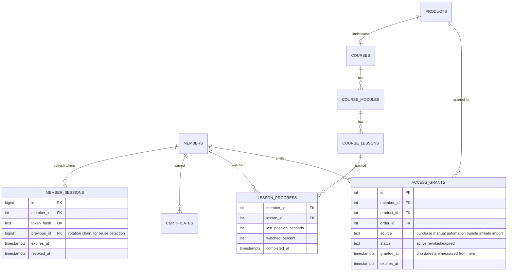

`access_grants` is `UNIQUE (member_id, product_id)` — one row per entitlement, refreshed rather
than duplicated.

### 7.3 Marketing and growth

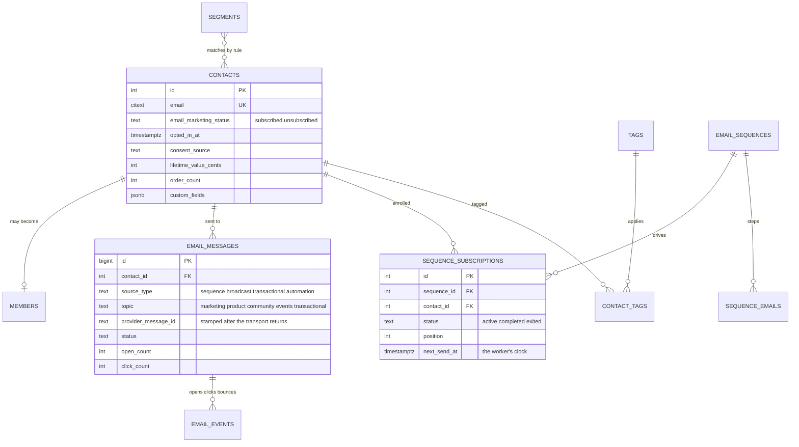

### 7.4 Affiliates

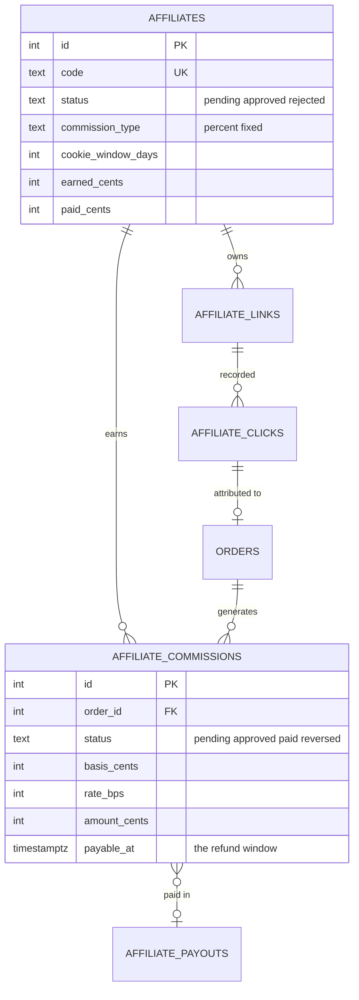

### 7.5 Platform

`jobs`, `job_schedules`, `webhook_endpoints`, `webhook_deliveries`, `api_keys`, `settings`,
`redirects`, `not_found_log`, `admin_users`, `admin_sessions`, `admin_invites`,
`admin_mfa_recovery_codes`, `admin_audit_log`, `report_daily`, `stripe_events`.

`stripe_events` is the webhook idempotency table — see the next section.

---

## 8. Core flows

### 8.1 Checkout → payment → fulfilment

The most important sequence in the codebase.

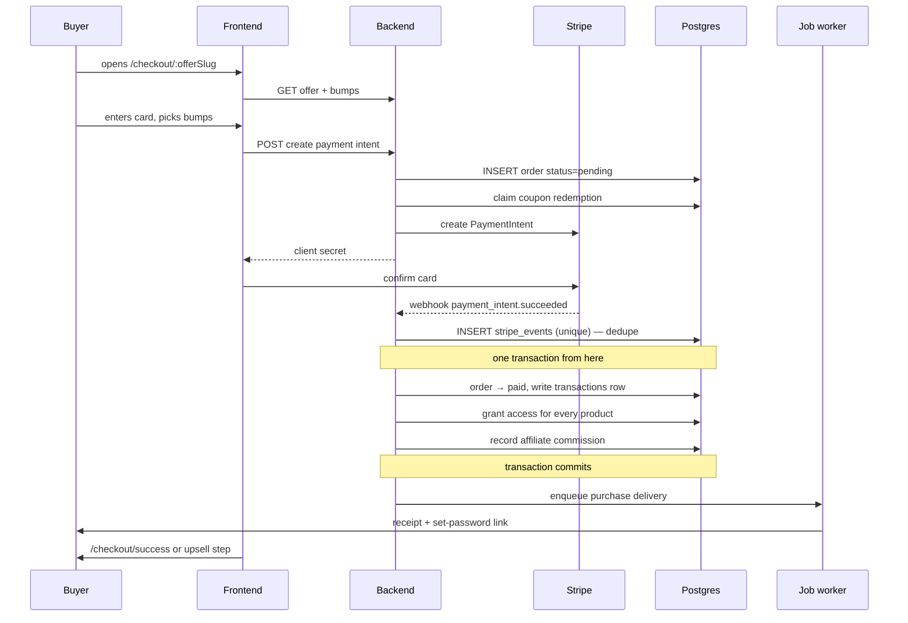

Two properties are non-negotiable in `services/fulfillment.ts`:

- **Idempotent.** Stripe retries webhooks — including after a timeout on a delivery that actually
  succeeded. Fulfilling twice means two receipts, two grants and doubled revenue. Every write is
  guarded so a second delivery changes nothing and still reports success.
- **Atomic.** Marking an order paid without granting access leaves a customer who has been charged
  and cannot open what they bought. The whole sequence is one transaction.

`services/purchaseDelivery.ts` owns the half the buyer *experiences* — receipt, account creation,
set-password link — and is fire-and-forget by contract: **nothing in it may throw**, because the
money has already moved and a mail outage must not turn a completed purchase into a webhook Stripe
retries and fulfils again. It has three callers: the webhook, a coupon-to-zero checkout, and the
admin's manual grant. The buyer's experience must not depend on which one they came through.

**Paths that produce no Stripe event at all.** The Payment Element creates the order before the
customer confirms. Close the tab and there is no `checkout.session.expired`, because there is no
Checkout Session — the order would sit `pending` forever, holding a coupon redemption that a
limited code can never get back. The `orders.sweepStale` job closes those after 120 minutes.

### 8.2 Member authentication

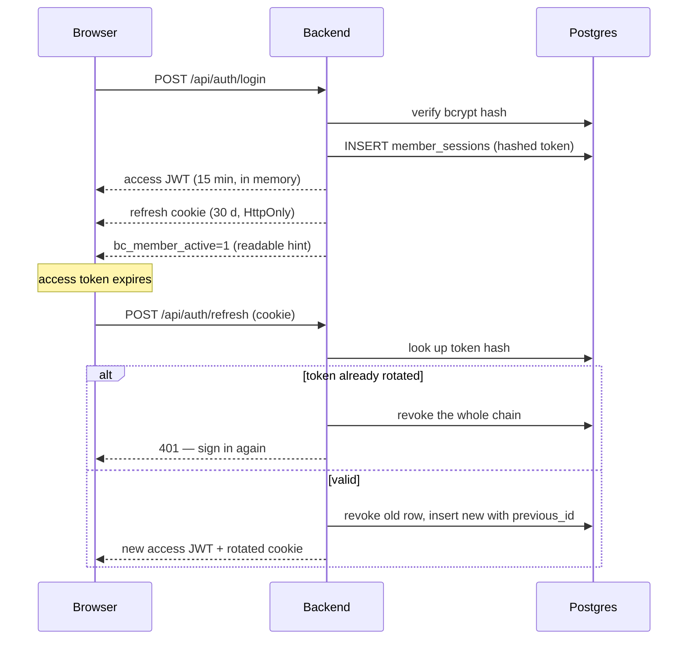

- The refresh token **rotates on every use**. The old row is not deleted; it is marked revoked and
  the new row records it as `previous_id`. Presenting an already-rotated token is only possible if
  it was captured, so the whole chain is revoked.
- `bc_member_active` holds no secret — its entire content is `"1"`. The refresh cookie is HttpOnly
  and path-scoped, so the app cannot otherwise tell whether a session exists, and would have to
  spend a round trip on every anonymous marketing-site visitor just to find out. Forging the hint
  buys an attacker exactly one 401.
- **Admin and member tokens are signed with different derived keys** (`auth/secrets.ts`), not with
  `JWT_SECRET` directly. The `aud` claim is belt and braces on top: a verifier can forget to check
  an audience, but it cannot forget to check a signature.

### 8.3 Automations — When / If / Then

`automations/engineV2.ts` supersedes `engine.ts`; v1 is left mounted until the switch is made.

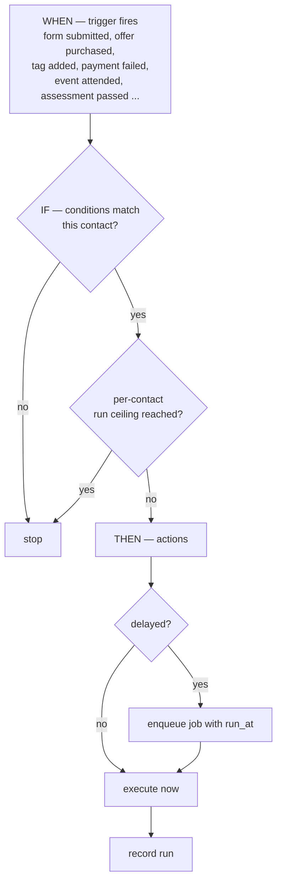

Three things distinguish it from v1, and each is a bug that was actually hit:

1. It acts on a **contact**, not an email address — so a PDF download no longer creates a member.
2. A delay is a **scheduled job**, not a held promise. An action set for three days out cannot be a
   `setTimeout` in a web process that gets redeployed on Thursday.
3. It **counts its own runs**. "Automation A adds tag X; automation B, triggered by tag X, adds tag
   Y; automation C, triggered by tag Y, adds tag X" is the second rule anybody writes. Without a
   per-contact ceiling it fills the queue until the database is what stops it.

### 8.4 Server-side rendering

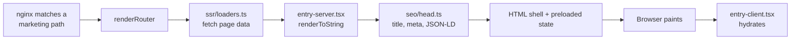

The frontend is built twice (`vite build` and `vite build --ssr`). The Express image carries the
SSR bundle plus the document shell; the nginx image carries the browser bundle. Both come from the
same build stage in `backend/Dockerfile`, so BuildKit runs the expensive Vite build once instead of
racing two copies of it on a 2-core box.

---

## 9. Background jobs

A Postgres-backed queue (`jobs` table) with a worker running **inside the API process**
(`WORKER_ENABLED=true`). Nothing else claims jobs — turn it off and work queues up that nobody does.

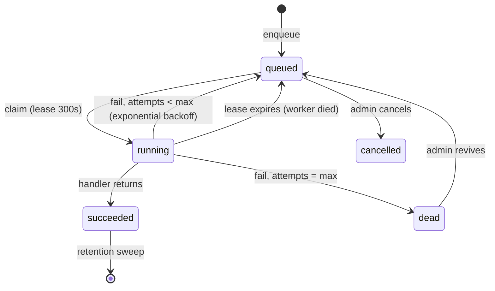

- **Leases, not locks.** A worker that dies mid-job lets its lease lapse and another worker
  reclaims the row. That is the entire crash-recovery story.
- **`dedupe_key`** stops the same logical job being queued twice.
- **Every sweep is idempotent and safe at any frequency.** "Did this already run today" is not a
  question a queue can answer reliably, and a sweep that is dangerous to repeat is a sweep nobody
  dares schedule.
- **Recurring work** lives in `job_schedules` (`every_minutes` or `daily_at_minute`), not in cron.

Core handlers (`jobs/handlers.ts`): `orders.sweepStale`, `plans.sweepDefaulted`,
`checkout.abandoned`, `access.sweepExpired`, `jobs.retention`. Feature modules register their own at
import time — `contactRollup`, `emailJobs`, `affiliateJobs`, `webhookJobs`, `reportJobs`,
`eventJobs`, `coachingJobs`.

---

## 10. Email

Every outbound message goes through one door: `email/provider.ts`. Do not call `sendMail` directly.

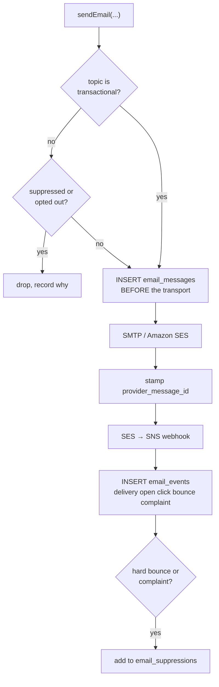

Two reasons the door exists:

- **Reporting.** Raw SMTP tells you nothing, so open and click figures would be permanently zero. A
  provider that posts webhooks only reports about messages it can *name*, so the row is written
  **before** the transport is called and the provider's id is stamped on it after. A message that is
  sent and not recorded is a bounce with nowhere to land.
- **Suppression.** A hard bounce or spam complaint means that address must never be mailed marketing
  again, and "never again" is not something each caller can be trusted to remember. The check lives
  ahead of the transport so forgetting it is not a thing a caller is *able* to do.

Preference topics are deliberately a short human list — `marketing`, `product`, `community`,
`events` — not one per sequence. A preferences page with forty checkboxes is a page nobody reads and
everybody unsubscribes from wholesale. `transactional` is absent on purpose: a receipt is not
optional.

⚠️ The SES account is on **probation** and is shared with another business. A bounce-heavy send can
pause the whole account, taking out the other product's mail too. Check the reputation dashboard
before the first broadcast. See [`docs/EMAIL.md`](docs/EMAIL.md).

---

## 11. Authentication and authorisation

Four separate identities. They do not share credentials, tokens, or signing keys.

```mermaid
flowchart TD
    subgraph Admin
        A1["POST /api/admin/login"] --> A2["bcrypt + optional MFA"]
        A2 --> A3["admin JWT + admin_sessions"]
        A3 --> A4["requireRole gate<br/>per admin route"]
    end
    subgraph Member
        M1["POST /api/auth/login"] --> M2["access JWT 15 min"]
        M2 --> M3["refresh cookie 30 d, rotating"]
    end
    subgraph Integrations
        I1["/api/v1/*"] --> I2["api_keys bearer<br/>Zapier-compatible"]
    end
    subgraph Signed_links
        S1["paid file request"] --> S2["signed, expiring,<br/>member-bound URL"]
    end
```

**Two upload roots, and they are not interchangeable.**

- `UPLOAD_DIR` → served at `/uploads` to anyone. Blog covers, testimonial photos, member avatars.
- `PROTECTED_UPLOAD_DIR` → served by nothing. Course video, lesson attachments, download-product
  files, coaching files, certificate PDFs. Reachable only through a signed link
  (`services/signedUrls.ts`).

The backend **refuses to boot** if `PROTECTED_UPLOAD_DIR` is nested inside `UPLOAD_DIR`, because
that would publish everything anybody ever paid for.

Admin routes are role-gated individually via `middleware/requireRole.ts`, and privileged actions
write to `admin_audit_log`.

---

## 12. Environment variables

Everything is read and validated in one place: `backend/src/config/env.ts`. Templates live in
`backend/.env.example`, `frontend/.env.example`, `ai/.env.example`. Real `.env` files are gitignored
and must stay that way.

| Variable | Notes |
|---|---|
| `DATABASE_URL` | Postgres. In compose, the in-network `db` host. |
| `JWT_SECRET` | Long and random. Admin and member keys are *derived* from it. |
| `ADMIN_EMAIL` / `ADMIN_PASSWORD` | Seeds the first admin on an empty database. |
| `PUBLIC_SITE_URL` | Absolute origin used to build every emailed link. Wrong value ⇒ verification, reset and magic-link emails all point at a page that does not exist. |
| `FRONTEND_ORIGIN` | CORS. `*` disables credentialed CORS — fine same-origin behind nginx. |
| `STRIPE_SECRET_KEY` | Absent ⇒ the app boots fine and checkout answers 503. It just cannot take money. |
| `STRIPE_WEBHOOK_SECRET` | Absent ⇒ every webhook is rejected as unsigned, so cards are **charged and never fulfilled**. |
| `UPLOAD_DIR` / `PROTECTED_UPLOAD_DIR` | See above. Separate volumes in compose. |
| `MAX_UPLOAD_MB` | Must stay ≤ nginx's `client_max_body_size`, or nginx returns an HTML 413 instead of the API's JSON error. |
| `SES_CONFIG_SET_*`, `SES_SNS_TOPIC_ARN` | Optional. Without them mail still sends; only delivery/bounce reporting stops. |
| `SEO_ALLOW_INDEXING` | `false` everywhere except the real domain. This app serves the same words as the live `bossclinician.com`; two indexed copies compete. |
| `WORKER_ENABLED` | `true` unless the worker is moved to its own container. |
| `AI_BASE_URL` | Internal address of the FastAPI service. |
| `OPENAI_API_KEY` | `ai/.env` only. Never reaches the browser. |

The Stripe **publishable** key is a Vite build arg in the repo-root `.env`, not a runtime variable —
changing it needs `docker compose build frontend`, not a restart.

---

## 13. Testing

```bash
cd backend
npm test                  # vitest, 45 test files
npm run typecheck         # tsc --noEmit
npm run test:integration  # spins a throwaway Postgres in Docker

cd frontend
npm run typecheck

./scripts/smoke-test.sh   # hits the running stack
```

Integration tests need a real database and are the ones worth trusting — the Stripe webhook and
affiliate attribution suites in particular.

**A warning that is in this README because it keeps being true:** a green run here has never once
caught the defects that actually reached production. Those were wiring failures — a router not
mounted, an nginx map not regenerated, a raw body parsed too early. Test the running system.

---

## 14. Deploying

Read [`DEPLOY.md`](DEPLOY.md) before touching production. The short version:

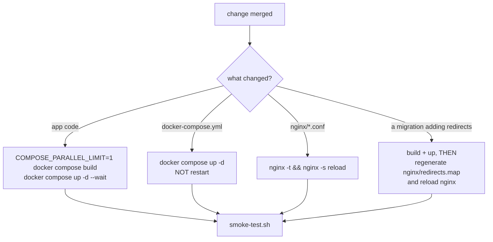

- `docker compose restart <svc>` restarts the *existing* container from the *existing* definition
  and applies nothing. It exits 0 and looks exactly like a successful deploy.
- Migrations write the `redirects` table, but nginx serves 301s from the generated
  `nginx/redirects.map`, which nothing regenerates on deploy. Run the generator **inside** the
  backend container — Postgres is not published to the host.
- `backups/` holds hand-made `pg_dump` snapshots only. **Nothing backs up either upload volume**,
  and `docker compose down -v` would destroy both, including every course video.

---

## 15. Conventions

- **TypeScript strict** everywhere, front and back. No `any` without a comment earning it.
- **Routes are thin.** Validate with zod, call a service, shape the response. Business logic lives
  in `services/`.
- **One writer per concept.** Access is granted in `services/access.ts`. Orders are paid in
  `services/fulfillment.ts`. Mail is sent in `email/provider.ts`. If you are about to write the
  second one of something, you are probably about to introduce the bug.
- **API is camelCase JSON; the database is snake_case.** Repos do the translation.
- **Money is integer cents.** Never a float, anywhere.
- **Comments explain *why*.** This codebase is unusually well commented and the comments are load-
  bearing — several record a production incident. Read them before changing the line above them,
  and update them when you do.
- **The frontend degrades rather than blanks.** Collections fall back to bundled defaults if the
  API is down, so the marketing site always renders.
- **No secrets in git.** Ever.
- **Admin UI copy is for a non-technical owner.** No engineering vocabulary in a label.

---

## 16. Traps that have already bitten someone

| Trap | What happens |
|---|---|
| Moving a raw-body mount below `express.json()` | Every Stripe and SES webhook fails signature verification, silently. |
| Mounting `renderRouter` before the API routers | The SSR router shadows API routes. |
| Editing `render.ts` paths without `nginx/site.conf` | The new page renders in dev and is a blank shell in production. |
| Adding a redirect migration without regenerating `redirects.map` | The row is in the database and the URL still 200s to the SPA. |
| `docker compose restart` after a compose change | Nothing is applied; the deploy silently no-ops. |
| Bind-mounting an nginx file instead of the directory | Write-by-rename pins the inode and the container reads the old file forever. |
| Raising `trust proxy` to 2 while nginx passes `X-Forwarded-For` through | Clients can forge their own IP. The two are coupled; change them together. |
| Assuming `req.ip` is the visitor | It is not. The k3d LB is a plain TCP proxy, so per-IP rate limits are effectively global and audit IPs are not evidence. See `docs/bugs/infra.md`. |
| Nesting `PROTECTED_UPLOAD_DIR` inside `UPLOAD_DIR` | Every paid asset becomes publicly downloadable. The backend refuses to boot instead. |
| Building services in parallel on this box | The OOM killer picks by score and usually takes Postgres or a k3s pod. |
| Testing checkout against the deployed stack | Stripe is in **live** mode. That is a real charge. |

---

## 17. Where to look for what

| I need to… | Start here |
|---|---|
| Understand what is mounted where | `backend/src/app.ts` |
| Add an API route | `backend/src/routes/<public\|auth\|member\|admin>/` |
| Change what happens after a payment | `backend/src/services/fulfillment.ts`, then `purchaseDelivery.ts` |
| Change who can open what | `backend/src/services/access.ts` |
| Send an email | `backend/src/email/provider.ts` |
| Add a background job | `backend/src/jobs/` — register in `handlers.ts` |
| Change the database | New file in `backend/src/db/migrations/`, next number |
| Add an admin screen | `frontend/src/pages/admin/`, route in `AdminApp.tsx` |
| Add a public page | `frontend/src/pages/`, route in `App.tsx`, **and** the SSR lists if it should be crawlable |
| Change SEO/meta | `frontend/src/seo/`, `backend/src/routes/public/seo.ts` |
| Touch the chatbot | `ai/app/` |
| Deploy | [`DEPLOY.md`](DEPLOY.md) |
| Find out what is already broken | [`docs/bugs/`](docs/bugs/), [`docs/AUDIT.md`](docs/AUDIT.md) |
