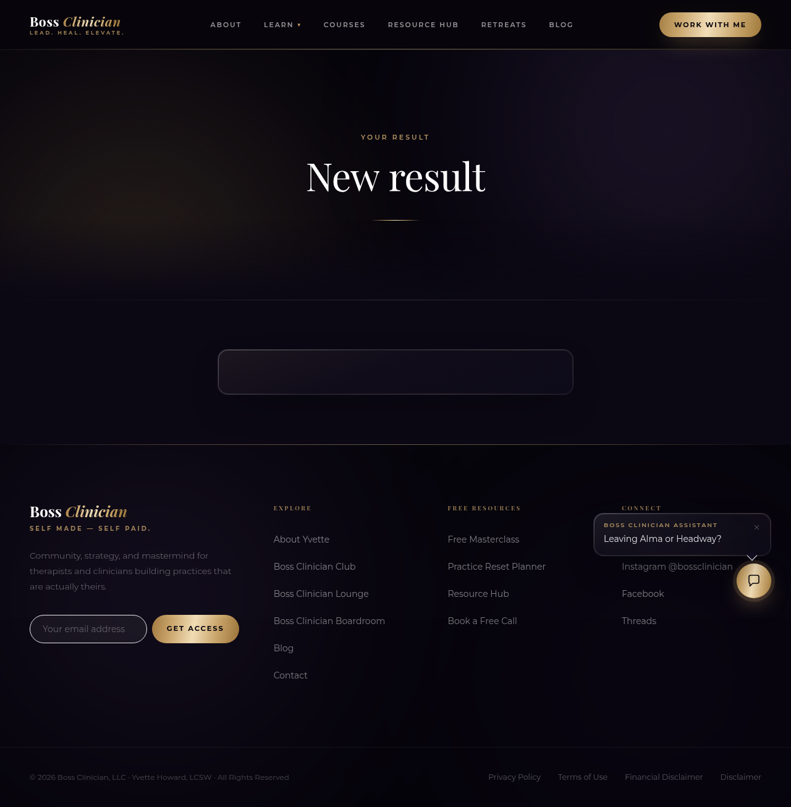

# Boss Clinician bug hunt — 12 September 2026

> **Superseded security and quiz acceptance:** the original shared-origin cookie check did not exercise an active admin cookie from a member page, and the quiz check missed fast submissions. See [the corrected live retest](RETEST-20260912.md). Do not use the original PASS claims below as launch evidence.

**The admin token-storage fix is deployed and verified on staging.** The public quiz and offer editor passed reproduction and final verification; no speculative changes were made to either. Lanes 1–3 ran in parallel, status checks finished, then root ran Lane V alone.

## Fix and acceptance results

| Lane | Result | Live evidence |
| --- | --- | --- |
| 1 — Admin session | **PASS — fixed.** Login returns user data only. Admin credentials use HttpOnly, Secure, SameSite=Lax cookies, scoped to `/api/admin`: five-minute access and an absolute eight-hour refresh session. CSRF checks run before state-changing admin handlers. A shared request client handles JSON, exports, PDFs and media upload refresh. Existing server roles and module gates remain intact. | Before: JavaScript read the admin bearer on both `/admin` and `/library` and used it to read contacts. After: `bc_admin_token` is null on both pages; neither cookie is readable through `document.cookie`. Reload and a second tab work. Hostile-origin and missing-origin writes return 403; same-origin writes reach validation and real fixture creation succeeds. [Auth evidence](verification/bug-hunt-20260912/auth-live.json). |
| 2 — Public quiz | **PASS — ALREADY FIXED.** Reproduced the complete visitor journey before and after deployment. | `/quiz/zz-test-practice-quiz`: START → “How confident are you as a business owner?” → answer → approved email → result, HTTP 201. Final attempt **8**, contact **67**, score **3/3**, persisted responses. Reload still shows the question. No browser errors. [Result data](verification/bug-hunt-20260912/quiz-result-after.json), screenshot below. The in-lesson renderer is separate and received no change. |
| 3 — Offer editor | **PASS in the requested five-visit test — ALREADY FIXED.** No freeze reproduced; no speculative virtualisation or effect changes. | Five link-driven visits in one SPA document: **62 / 267 / 261 / 264 / 261 ms**. Full 18-product catalogue; 17 unattached choices plus prompt; six tabs including Upsells. Five bounded GETs per visit, no stacked intervals, stable DOM/listener counts, no page errors. [Profile](verification/bug-hunt-20260912/lane3-final-profile.json). This short test cannot rule out every intermittent freeze in other sessions. |

Migration `057_admin_cookie_sessions.sql` deliberately revoked all legacy admin sessions, including copied seven-day tokens. Administrators must sign in once after this release.

The design keeps session lifecycle and CSRF policy in one backend service and cookie/refresh/retry behavior in one frontend transport. Controllers retain password/MFA checks and their existing authorization gates. No unrelated product code was changed for these findings.

## Lane V — final regressions

| Check | Result and evidence |
| --- | --- |
| Natural expiry and refresh | **PASS.** After **324.8 seconds** of real elapsed time, `/admin/me` returned 401, `/admin/refresh` returned 204, then `/admin/me` returned 200. No clock or database expiry manipulation. The server session deadline remained eight hours from login. The first harness incorrectly required identical fractional browser cookie-expiry timestamps; a subsecond browser clock adjustment was corrected with a one-second tolerance and the original naturally expired session was re-tested. |
| Sign-out and second tab | **PASS.** UI logout returned 204 and removed both cookies. Replaying the saved access cookie returned 401; replaying refresh returned 401. Reloading the second tab returned to login. [Auth evidence](verification/bug-hunt-20260912/auth-live.json). |
| Whole admin after auth change | **PASS.** All **44 navigation destinations** exercised at **1280px and 1440px**, 88 checks: no visible controls past the viewport, page errors or non-auth API failures. Reloaded pages used cookie auth. [Route results](verification/bug-hunt-20260912/admin-lists.json). This covers navigation/read surfaces, not every possible business mutation. |
| Exports, PDF and upload clients | **PASS.** Visible member CSV export downloaded 935 bytes. Admin receipt PDF downloaded 2560 bytes beginning `%PDF-`. Media upload completed with the correct 201 status and persisted after reload. Initial harness expected 200; corrected against the actual creation contract. [File results](verification/bug-hunt-20260912/admin-files.json). |
| Member-only admin access | **PASS.** Member bearer received **401** on `/api/admin/contacts`, `/api/admin/offers`, `/api/admin/settings`. |
| Receipt authorization | **PASS.** Order 9 owner received HTTP 200, `application/pdf`, `%PDF-`, 2560 bytes and an attachment Content-Disposition. Another member received **404**. [Regression evidence](verification/bug-hunt-20260912/regression.json). |
| Email delivery and authentication | **PASS for delivery/authentication; inbox placement caveat.** Sent to `sagar+zz-bughunt-v-email@callsphere.ai`, opened Gmail message `1a0971891b988fd8`: correct staging From, **SPF/DKIM/DMARC pass**. Gmail placed this settings test in **Spam**. The final quiz-triggered sequence email to the approved quiz alias reached the inbox and also passed all three. [Headers and bodies](verification/bug-hunt-20260912/v-email-authentication.json). No other recipients were used. |
| Funnel blueprint | **PASS.** A new opt-in blueprint created **3 stages, form 20, joined tag 51 and follow-up sequence 13**. Fresh reads confirmed the links and stages. [Regression evidence](verification/bug-hunt-20260912/regression.json). |
| Coaching session with notes | **PASS.** Sessions tab showed the booked session; its editor retained “Agenda: pricing review.” and “Private: watch cashflow.” No modification or email to this client. [Screenshot](verification/bug-hunt-20260912/coaching-notes.png). |
| Two-member DM | **PASS.** Members 40 and 53 exchanged two messages, both APIs returned both messages, and the visible conversation persisted after reload. Markup probe was stripped before storage; no event-handler image or script execution occurred. [Screenshot](verification/bug-hunt-20260912/dm-exchange.png). |
| Marketing Overview arithmetic | **PASS after cleanup and reload.** Sent 3=1+2+0; not sent 0=0+0+0; sequence enrolments 0; form replies 3; problem runs 2; upcoming events 2=1 published+1 draft. Displayed breakdown sums match these headlines. [Fresh readback](verification/bug-hunt-20260912/final-readback.json). |

## XSS sweep

Community posts/comments, DM bodies, lesson comments, member names, form answers and quiz responses render as React text. Markdown renderers do not enable raw HTML. Lesson embeds use an opaque-origin sandbox; receipt HTML uses escaped interpolation and a script-free sandbox. Static inspection found no executable direct HTML-insertion sink in application frontend code. Actual PostBody/Markdown renderer probes passed, and the live persisted DM probe did not execute. No concrete underlying XSS was reproduced; this is a bounded review, not a claim of exhaustive XSS coverage. [Inspected surfaces and tests](BUG-HUNT-LANE1.md).

## Lane 4 — status only, no fixes

| Area | Status and evidence | Worth building |
| --- | --- | --- |
| Team, roles, permissions | **PARTIAL.** Owner, Manager, Marketing, Support and Coach roles have server module gates; 50 live read/write probes plus invite checks exercised refusals. **A fresh Coach retrieved another session’s private notes through `/api/admin/growth/coaching/sessions` without an assignment.** The stated own-record restriction is not enforced there. | **High priority privacy fix:** scope coaching records on the server. Left unchanged under the explicit status-only instruction. |
| Webhooks / Connections | **PRESENT.** Signed `test.ping` delivered to an HTTPS echo receiver with HTTP 200. A 503 endpoint automatically advanced to a second attempt. Payload/response/error logs are readable; replay queued a new delivery. Catalogue contains 13 events; individual business-event emission was not exhaustively exercised. [Delivery evidence](verification/bug-hunt-20260912/webhook-deliveries.json). | Basic delivery exists; test business-event coverage and operational reliability next. |
| Podcast RSS | **PARTIAL.** Public XML parses, but there are **zero episodes** and **1365 × 768** artwork. Missing/invalid/revoked private-feed tokens return 403; valid token returns 200 with private caching. Audio playback and actual directory acceptance remain **blocked by no published episode**. | Finish episodes and suitable artwork, then submit/validate. [Podcast evidence and official requirements](BUG-HUNT-PODCAST-STATUS.md). |
| Newsletter publishing/send | **PARTIAL.** Visible Send flow sent exactly one approved recipient through shared SES; reload showed Sent and recipient count 1; opened message passed SPF/DKIM/DMARC. The issue is marked Sent before detached sending finishes, and deliveries lack issue-level attribution. | Add durable issue jobs and truthful delivery/failure reporting. |
| Form double opt-in | **PARTIAL, confirmation flow absent.** Saved true flag persisted, but submission immediately subscribed the contact, with no confirmation email and null confirmation time. | Build and connect the confirmation workflow. |
| Form embed snippet | **ABSENT.** Public link exists, but no supported embed/copy-code flow was found. | Useful for lead capture on external sites. |

Detailed event catalogue, role matrix and sending evidence: [status sweep](BUG-HUNT-STATUS.md). Forms evidence: [forms report](BUG-HUNT-FORMS-STATUS.md). Status items were not changed.

## Deployment, validation and cleanup

Backend and frontend were built and deployed together; both are healthy and migration 057 is present. Both typechecks passed; **187 frontend tests** and **15 isolated auth/download/receipt integration tests** passed; diff whitespace checks passed. [Running services](verification/bug-hunt-20260912/deployed-services.json), [frontend log](verification/bug-hunt-20260912/frontend-all.log), [integration log](verification/bug-hunt-20260912/regression-integration.log).

Removed test contacts 64–67, attempts 7–8, temporary admins 6–11 and sessions, form 19/submission 15, newsletter 3/issue 3/plan 4/subscription 3, community 4 and its messages/notifications, media asset 18 and upload session, webhook endpoints/deliveries, and podcast 4/token 2. Also removed requested old funnel **12, “ZZ Sep12 — funnel scaffold test”**, and new funnel 13 with their linked forms, tags and sequences. Fresh API/UI reads and database checks show these gone. Baseline restored to **8 contacts and 4 members**. [Cleanup proof](verification/bug-hunt-20260912/cleanup-final.log).

Already delivered test emails remain in the approved Gmail mailbox; audit/security logs remain as records of the checks. No business fixture could not be removed. Temporary credential files were removed after verification. No real charges and no writes to Kajabi were performed.

The contact migration remains an owner decision: the supplied Kajabi count is 403, while this staging database has eight contacts after cleanup. Matching, de-duplication, tags, purchase history and unsubscribe treatment must be agreed before import; no silent import was attempted.
