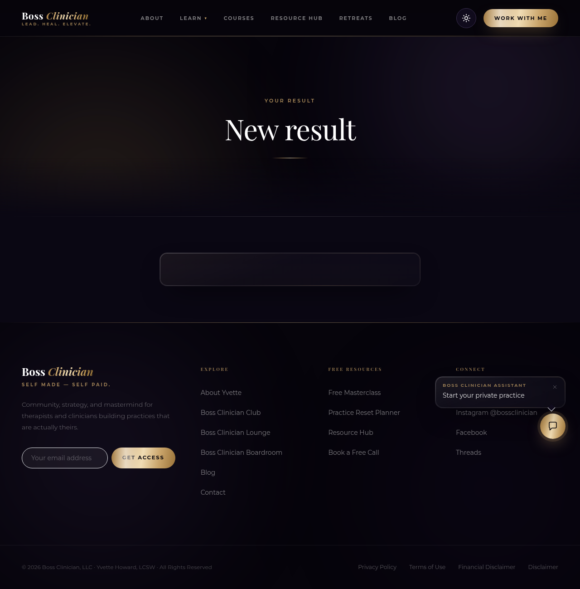
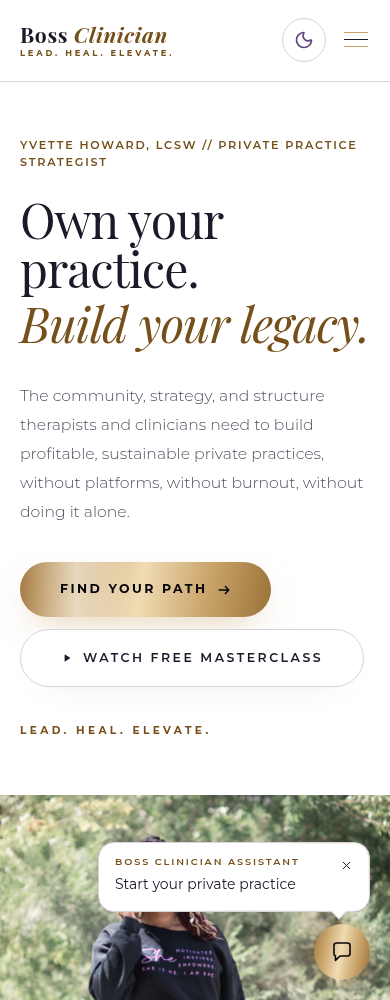

# Boss Clinician — corrected staging retest, 12 September 2026

The earlier verification was incomplete: member bearer-token refusal did not test a browser with an active admin cookie. A normal-speed quiz completion also missed the fast-submission discard path. Both defects were reproduced before changing them.

## Admin isolation

The admin now lives at **https://admin.bossclinician.callsphere.site/admin**. Existing public `/admin` bookmarks redirect there. DNS and a valid TLS certificate were provisioned; the public site remains on its original hostname.

Public `/api/admin/*` returns 401 independently of credentials. The backend also requires the configured admin host, so this does not rely only on frontend navigation or nginx. Public/member/quiz/form/upload paths cannot render under the admin origin. Cookie Path is not the isolation mechanism: it controls destinations, not callers.

Admin cookies are host-only `__Host-` cookies with HttpOnly, Secure and SameSite=Lax. Access expires after five minutes; refresh retains an absolute eight-hour deadline. State-changing requests require the exact admin Origin, with Fetch Metadata checks. Migration 058 revoked old shared-origin sessions; a database check found **zero unrevoked sessions predating isolation**. Existing role and session-revocation checks remain in place.

| Live check | Result |
| --- | --- |
| Signed-in member `/account`, in a browser also carrying an active administrator session | **PASS:** plain fetches for contacts, offers and settings each returned **401**. Admin token was null in localStorage. [Exact evidence](verification/retest-20260912/exact-retest.json). |
| Admin reload, second tab, token unreadability | **PASS:** admin loads, cookies are HttpOnly and host-only, login returns only user data. Final expiry/logout evidence is recorded below. |
| Cross-origin reads and writes | **PASS:** public-to-admin reads are not CORS-readable (the allowed origin is the admin host, not the public host); public Origin and missing Origin writes return **403**. Admin-origin fixture writes succeed; invalid bodies reach 400 validation. |
| Public/admin navigation and member preview | **PASS:** both navigation directions cross to their proper origin. “View as member” opens the public library using only a member preview credential; public admin fetch remains 401. [Regression evidence](verification/retest-20260912/regression.json). |
| Whole admin | **PASS for navigation/read coverage:** 44 navigation destinations at actual **1280px and 1440px**, 88 checks, no overflowing visible controls, page exceptions or non-auth API errors. This does not claim every possible business mutation was exercised. [Results](verification/retest-20260912/admin-lists.json). |
| CSV, PDF, media | **PASS:** visible CSV/PDF downloads worked; PDF starts `%PDF-`; upload returned 201 and appeared after reload. [Evidence](verification/retest-20260912/admin-files.json). |

Access logs were reviewed from 18:00 to 20:08 UTC. They contain the known successful public-page reproductions before isolation. All **31** recorded public `/api/admin/*` requests after isolation returned 401. The retained logs do not establish malicious use or rule it out: some calls have no referrer, and upstream proxy addresses/user agents do not identify a person. Raw logs remain private. [Bounded review](verification/retest-20260912/access-review-summary.json).

## Quiz persistence

Before the fix, a browser completion in **316 ms** returned 201 and displayed a result with **zero contact and attempt records**. The elapsed-time bot heuristic skipped writes but returned success. That heuristic was removed. The honeypot now explicitly rejects with 400 instead of displaying an unsaved success. Valid submissions await persistence and return an `attemptId`; the visitor UI requires that saved receipt before showing a result.

Both full browser journeys passed: START → visible question → answer → captured name/email → result. Fast completion saved **attempt 10/contact 70**; normal completion saved **attempt 11/contact 71**. Both persisted question 1/answer 1 and the configured **Quiz — Steady Grower** tag. “Taken by” increased **3 → 4 → 5**, confirmed in the admin after reload. Names and approved email aliases appeared in Contacts. [Database evidence](verification/retest-20260912/quiz-persistence-db.txt), [admin readback](verification/retest-20260912/additional-ui.json).

The existing quiz result is titled “New result” and has no configured body; the test preserved that configuration.

Fast/repeated-contact/honeypot integration tests and existing lesson assessment tests passed **4/4**. The in-lesson renderer is separate; its persistence was regression-tested rather than replaced.

## Website appearance

Public and member pages have a persistent light/dark toggle. Light mode uses white page and section backgrounds with dark readable text. Yvette/owner portraits retain their original image bytes and colors in either theme: removed grading filters, masks, tints and overlapping grain across the homepage, About, Work With Me, Resource Hub, Contact, Blog, Courses and Retreats. Admin console appearance remains independently controlled.

Live measurements cover ten public/auth/quiz routes, both themes, **390px and 1440px**: **40 checks, zero page exceptions, zero overflow and zero failed portrait loads**. [Measurements](verification/retest-20260912/live-theme.json). The signed-in account was also checked after reload. Portraits load with no filter/mask or tint overlays. Light-mode section backgrounds are `rgb(255, 255, 255)`; no horizontal overflow was found. During verification, identity redirects and hydration mismatches were reproduced and repaired: reduced-motion chat markup now stays structurally consistent, and deferred server-rendered content keeps its original hydration snapshot.

## Other live regressions

- Offer 2: five visits in one SPA tab, **65 / 279 / 263 / 281 / 279 ms**; all six tabs including Upsells, full available catalogue, no stacked intervals. [Profile](verification/retest-20260912/lane3-final-profile.json).
- Member bearer tokens receive 401 on contacts/offers/settings on both hosts. Receipt 9 owner receives 200, `application/pdf`, `%PDF-`, Content-Disposition; the other member receives **404**.
- Payments settings retain billing portal, retry/dunning copy, reminders and cancellation reasons. Coaching retains its booked session and saved notes. Marketing Overview sent/not-sent headlines equal their breakdown sums.
- A new funnel blueprint persisted **three stages, form 21, tag 54 and sequence 14**. Two members exchanged messages and the visible conversation survived reload.
- SES test sent only to `sagar+zz-origin-verify@callsphere.ai`; opened Gmail message `1a097386f4271a88` showed **SPF/DKIM/DMARC pass** and the staging sender. **Gmail placed this settings test in Spam**; delivery authentication is not a claim of inbox placement. [Headers](verification/retest-20260912/email-authentication.json).

## Cleanup and remaining scope

Removed contacts **68–71** (including the supplied footer test), attempts **9–11**, funnel **14** and its linked form/tag/sequence, community **5** and its messages/notifications, media asset **19** and upload session. The earlier “ZZ Sep12 — funnel scaffold test” was already absent. API deletions and database readback confirm these records are gone. Delivered test emails and audit/security logs remain as evidence. No real charge, unrelated-recipient send or Kajabi write occurred.

Earlier status-only findings remain separate work: coach record scoping, complete podcast publishing/RSS acceptance, durable newsletter delivery reporting, form double opt-in and embed support. Those are **not fixed or newly verified by this follow-up**; the earlier status evidence remains in the [status sweep](BUG-HUNT-STATUS.md).

The 403-contact Kajabi migration remains an account-owner decision about matching, deduplication, purchase/tag history and unsubscribe treatment. No silent import was attempted.

## Final release verification

**PASS, final deployment healthy.** After **301.2 seconds** of real elapsed time, reload received 401, refresh returned 204, and admin data loaded again. The access token renewed while the absolute refresh deadline stayed unchanged. UI sign-out removed both cookies; saved access and refresh replay each returned 401; the second tab returned to login. [Final auth evidence](verification/retest-20260912/auth-live.json).

The final public build passed all 40 theme/portrait checks with no page exceptions, including reduced motion. Normal-motion home/blog/about hydration and theme persistence into a second tab also passed. Both typechecks, 187 frontend tests, six isolated auth integration tests and four quiz/lesson integration tests passed. [Normal-motion proof](verification/retest-20260912/normal-motion.json), [release image IDs](verification/retest-20260912/release-images.txt).

Temporary admin 12 and its sessions, test member sessions and credential files were removed. Final database readback: **eight contacts**, the **two original quiz attempts**, zero temporary admin/contact/media/funnel records and zero active legacy sessions. [Final cleanup](verification/retest-20260912/cleanup-final.log).
